# ML 24/25-03 Implement Anomaly Detection Sample

# Introduction: 
Our project aims to develop an anomaly detection system using the NeoCortex API's MultiSequenceLearning class. The system trains an HTM engine by processing numerical sequences extracted from multiple JSON files within a designated folder. Once trained, the engine analyzes patterns in the data and effectively detects anomalies..

# Tools for the project:

1. .NET 8.0 SDK**  
2. NuGet Packages:** NeoCortexApi (v1.1.4), XPlot.Plotly (v4.0.6)  
3. IDE: Visual Studio Community 2022 / Visual Studio Code

# How to Use 

Follow these steps to run the project:  

1. Install the .NET SDK.  
2. Open the project in your preferred code editor or IDE (e.g., Visual Studio Community 2022).  
3. Add the required NuGet packages to the project.  
4. Place numerical sequence JSON files (datasets) in the designated folders within the project directory.  
5. Run the command `dotnet run`, enter the required tolerance value, and press **Enter**.  
6. The output will be displayed in the terminal, and a graph highlighting anomalies will open in your default browser.  

This project utilizes the **NeoCortex API** for anomaly detection.More details [here](https://github.com/ddobric/neocortexapi/blob/master/source/Documentation/gettingStarted.md).

## Project Summary:

HTM (Hierarchical Temporal Memory) is a machine learning algorithm that processes time-series data in a distributed manner using a hierarchical network of nodes. Each nodes, or columns, can be trained to learn, and recognize patterns in input data. This can be used in identifying anomalies/deviations from normal patterns. It is a promising method for predicting and detecting anomalies in a range of applications. In this project, we will train our HTM Engine using the multisequencelearning class in the NeoCortex API, and then use the trained engine to learn patterns and identify anomalies. Specifically, numerical sequences will be read from various CSV files inside a folder in order to create an anomaly detection system.  


## Project Description

To train our HTM Engine, we used the [MultiSequenceLearning](https://github.com/ddobric/neocortexapi/blob/master/source/Samples/NeoCortexApiSample/MultisequenceLearning.cs) class in the NeoCortex API. Firstly, we will read and train the HTM Engine using the data from both our training (learning) and predicting (predictive) folders, which are present as numerical sequences in CSV files in the 'training' and 'predicting' folders inside the project directory. We will read numerical sequence data from the prediction folder for testing purposes, remove the first few elements (thus effectively turning the data into a subsequence of the original sequence; we have already inserted anomalies at random indexes into this data), and then use it to detect anomalies.

Please take note that all files inside the folders are read with the.csv extension, and exception handlers are set up in case the file format is incorrect.

We are employing artificial integer sequence data of network load for this project, which is saved inside of CSV files and is rounded off to the nearest integer, in percentage. Example of a csv file within training folder.

```
69,72,75,68,72,67,66,70,72,67
69,72,75,68,72,67,66,70,69,67
68,74,75,68,72,67,66,70,69,65
71,74,75,68,72,67,66,70,69,65
```
Normally, the values stay within the range of 65 to 75. All values outside of this range are considered anomalies for testing purposes. However, in order to identify anomalies, we have a csv file in the predicting folder. Typically, some of the data in this file does not fall within 65 and 75. 

```
71,74,98,68,92,65,66,70,69,65
71,74,75,68,72,65,66,30,69,35
71,74,75,71,72,65,36,70,69,65
71,75,75,71,72,65,66,70,98,95
```
We have uploaded the anomaly results of our data in this repository for reference.

1. output result of combined numerical sequence data from training folder (without anomalies) and predicting folder (with anomalies) can be found [here](https://github.com/mahbubur-r/neocortexapi/tree/Team_Anomaly_Detection/source/MySEProject/AnomalyDetectionSample/output).

Work process flow chart:

```mermaid

graph LR;
    Start["🚀 Start Project"] --> |📂 Read JSON Data| ExtractSequences["📊 Extract Sequences"];
    ExtractSequences --> |🔄 Process & Structure Data| ConvertSequences["🔁 Convert Sequences"];
    ConvertSequences --> |🧠 Prepare HTM Input| TrainModel["📖 Train Model"];
    TrainModel --> |📈 Identify Patterns| AnomalyDetection["⚠️ Anomaly Detection"];
    AnomalyDetection --> |💾 Save Results & Generate Graph| StoreOutput["📊 Store Output"];
```



1. **Start Project**
    - Begin the project execution.

2. **Extract Sequences From Folder**
    - Extract sequences from the designated folder for further processing.

3. **Convert Sequences for HTM Training**
    - Convert the extracted sequences into a format suitable for Hierarchical Temporal Memory (HTM) training.

4. **Train Model for Converted Sequences**
    - Train the HTM model using the converted sequences.

5. **Anomaly Detection Based on Predicting Folder Sequence**
    - Perform anomaly detection based on the sequences from the predicting folder.

6. **Store Anomaly Output in Text File**
    - Store the output of anomaly detection in a text file for further analysis or reporting purposes.

## Execution of the project

The following is how our project is carried out.
 
* In the beginning, we have ExtractSequencesFromFolder method of [CsvSequenceFolder](https://github.com/mahbubur-r/neocortexapi/blob/Team_Anomaly_Detection/source/MySEProject/AnomalyDetectionSample/CsvSequenceFolder.cs) class to read all the files placed inside a folder. These classes keep track of the read sequences in a list of numerical sequences that will be used repeatedly in the future. To handle non-numeric data, some classes have incorporated exception handling inside. With the Trimsequences technique, data can be trimmed. It returns a numeric sequence after trimming one to four components (numbers 1 through 4) from the start.

```csharp
 public List<List<double>> ExtractSequencesFromFolder()
        {
         ....  
          return folderSequences;
        }

public static List<List<double>> TrimSequences(List<List<double>> sequences)
        {
        ....
          return trimmedSequences;
        }
```
* After that, the method ConvertToHTMInput of [CSVToHTMInputConverter](https://github.com/mahbubur-r/neocortexapi/blob/Team_Anomaly_Detection/source/MySEProject/AnomalyDetectionSample/CSVToHTMInputConverter.cs) class is there which converts all the read sequences to a format suitable for HTM training.

```csharp
Dictionary<string, List<double>> dictionary = new Dictionary<string, List<double>>();
for (int i = 0; i < sequences.Count; i++)
    {
     // Unique key created and added to dictionary for HTM Input                
     string key = "S" + (i + 1);
     List<double> value = sequences[i];
     dictionary.Add(key, value);
    }
     return dictionary;
```
* After that, we have ExecuteHTMModelTraining method of [HTMTrainingService](https://github.com/mahbubur-r/neocortexapi/blob/Team_Anomaly_Detection/source/MySEProject/AnomalyDetectionSample/HTMTrainingService.cs) class to train our model using the converted sequences. The numerical data sequences from training (for learning) and predicting folders are combined before training the HTM engine. This class returns our trained model object predictor.
```csharp
.....
MultiSequenceLearning learning = new MultiSequenceLearning();
predictor = learning.Run(htmInput);
.....
.....
List<List<double>> combinedSequences = new List<List<double>>(sequences1);
combinedSequences.AddRange(sequences2);
.....
```
* In the end, we use [HTMAnomalyDetector](https://github.com/mahbubur-r/neocortexapi/blob/Team_Anomaly_Detection/source/MySEProject/AnomalyDetectionSample/HTMAnomalyDetector.cs) to detected anomalies in sequences read from files inside predicting folder. All the classes explained earlier- CSV files reading (CsvSequenceFolder), combining and converting them for HTM training (CSVToHTMInputConverter) and training the HTM engine (using HTMTrainingManager) will be used here. We use the same class (CsvSequenceFolder) to read files for our predicting sequences. TrimSequences method is then used to trim sequences for anomaly testing. Method for trimming is already explained earlier.

```csharp
.....
CsvSequenceFolder testSequencesReader = new CsvSequenceFolder(_predictingCSVFolderPath);
var inputSequences = testSequencesReader.ExtractSequencesFromFolder();
var trimmedInputSequences = CsvSequenceFolder.TrimSequences(inputSequences);
.....
```
Path to training and predicting folder is set as default and passed on the constructor, or can be set inside the class manually.

```csharp
.....
_trainingCSVFolderPath = Path.Combine(projectBaseDirectory, trainingFolderPath);
_predictingCSVFolderPath = Path.Combine(projectBaseDirectory, predictingFolderPath);
.....
```
In the end, DetectAnomaly method is used to detect anomalies in our trimmed sequences one by one, using our trained HTM Model predictor. 
```csharp
foreach (List<double> list in triminputtestseq)
       {
         .....
         double[] lst = list.ToArray();
         DetectAnomaly(myPredictor, lst);
       }
```
Exception handling is present, such that errors thrown from DetectAnomaly method can be handled (like passing of non-numeric values, or number of elements in list less than two).

[DetectAnomaly](https://github.com/mahbubur-r/neocortexapi/blob/98ae630c79221e9d7a792282c5faabc08a2b794f/source/MySEProject/AnomalyDetectionSample/HTMAnomalyExperiment.cs#L105) is the main method from ExtractSequencesFromFolder class which detects anomalies in our data. It traverses each value of a list one by one in a sliding window manner, and uses trained model predictor to predict the next element for comparison. We use an anomalyscore to quantify the comparison and detect anomalies; if the prediction crosses a certain tolerance level, it is declared as an anomaly.

In our sliding window approach, naturally the first element is skipped, so we ensure that the first element is checked for anomaly in the beginning.

We can get our prediction in a list of results in format of "NeoCortexApi.Classifiers.ClassifierResult`1[System.String]" from our trained model Predictor using the following:

```csharp
var res = predictor.Predict(item);
```
Here, assume that item passed to the model is of int type with value 8. We can use this to analyze how prediction works. When this is executed,
```csharp
foreach (var pred in res)
 {
   Console.WriteLine($"{pred.PredictedInput} - {pred.Similarity}");
    }
```
We get the following output.
```
S2_2-9-10-7-11-8-1 - 100
S1_1-2-3-4-2-5-0 - 5
S1_-1.0-0-1-2-3-4 - 0
S1_-1.0-0-1-2-3-4-2 - 0
```
We know that the item we passed here is 8. The first line gives us the best prediction with similarity accuracy. We can easily get the predicted value which will come after 8 (here, it is 1), and previous value (11, in this case). We use basic string operations to get our required values.

We will then use this to detect anomalies.

* When we iteratively pass values to DetectAnomaly method using our sliding window approach, we will not be able to detect anomaly in the first element. So, in the beginning, we use the second element of the list to predict and compare the previous element (which is the first element). A flag is set to control the command execution; if the first element has anomaly, then we will not use it to detect our second element. We will directly start from second element. Otherwise, we will start from first element as usual.

* Now, when we traverse the list one by one to the right, we pass the value to the predictor to get the next value and compare the prediction with the actual value. If there's anomaly, then it is outputted to the user, and the anomalous element is skipped. Upon reaching to the last element, we can end our traversal and move on to next list.

We use anomalyscore (difference ratio) for comparison with our already preset threshold. When it exceeds, probable anomalies are found.

To run this project, use the following class/methods given in [Program.cs].

```csharp
HTMAnomalyExperiment tester = new HTMAnomalyExperiment();
tester.ExecuteExperiment();
```
### HTM Engine Settings:

It is crucial that our input data be encoded so that our HTM Engine can process it. More on [this](https://github.com/ddobric/neocortexapi/blob/master/source/Documentation/Encoders.md). 

We are utilizing the following settings since we will be training and testing data that falls between the range of integer values between 0-100 without any periodicity. Since we only expect values to fall inside this range, the minimum and maximum values are set to 0 and 100, respectively. These numbers must be adjusted for other usage scenarios. More on [this](https://github.com/mahbubur-r/neocortexapi/blob/0da3d6b9ac2e654e80b4bab9a84ad2e26f887028/source/MySEProject/AnomalyDetectionSample/multisequencelearning.cs#L22-L64)
 
Complete settings is [here](https://github.com/mahbubur-r/neocortexapi/blob/0da3d6b9ac2e654e80b4bab9a84ad2e26f887028/source/MySEProject/AnomalyDetectionSample/multisequencelearning.cs#L54-L64)

The configuration that we have used is as follows. More on [this](https://github.com/ddobric/neocortexapi/blob/master/source/Documentation/SpatialPooler.md#parameter-desription)
HTM Configuration is [here](https://github.com/mahbubur-r/neocortexapi/blob/0da3d6b9ac2e654e80b4bab9a84ad2e26f887028/source/MySEProject/AnomalyDetectionSample/multisequencelearning.cs#L26-L50)

### Multisequence learning

The [multisequencelearning](https://github.com/mahbubur-r/neocortexapi/blob/Team_Anomaly_Detection/source/MySEProject/AnomalyDetectionSample/multisequencelearning.cs) class file's [RunExperiment](https://github.com/mahbubur-r/neocortexapi/blob/34299872fcd5cdb30e6ab5fa41f8d46a19e6331e/source/MySEProject/AnomalyDetectionSample/multisequencelearning.cs#L74) method provides an example of how multisequence learning functions. As a summary,

* Initialization of connection memory and [HTM configuration](https://github.com/mahbubur-r/neocortexapi/blob/0da3d6b9ac2e654e80b4bab9a84ad2e26f887028/source/MySEProject/AnomalyDetectionSample/multisequencelearning.cs#L81) are performed. The [HTM Classifier](https://github.com/mahbubur-r/neocortexapi/blob/0da3d6b9ac2e654e80b4bab9a84ad2e26f887028/source/MySEProject/AnomalyDetectionSample/multisequencelearning.cs#L85), [Cortex layer](https://github.com/mahbubur-r/neocortexapi/blob/0da3d6b9ac2e654e80b4bab9a84ad2e26f887028/source/MySEProject/AnomalyDetectionSample/multisequencelearning.cs#L91), and [Homeostatic Plasticity Controller](https://github.com/mahbubur-r/neocortexapi/blob/0da3d6b9ac2e654e80b4bab9a84ad2e26f887028/source/MySEProject/AnomalyDetectionSample/multisequencelearning.cs#L96) are then initialized.

* Following that, Temporal Memory and Spatial Pooler are initialized.

```csharp
.....
TemporalMemory tm = new TemporalMemory();
SpatialPoolerMT sp = new SpatialPoolerMT(hpc);
.....
```
* The cortical layer is then added with spatial pooler memory, which is trained for the maximum number of cycles.

```csharp
.....
layer1.HtmModules.Add("sp", sp);
int maxCycles = 3500;
for (int i = 0; i < maxCycles && isInStableState == false; i++)
.....
`````
* In order to learn every input sequence, temporal memory is then introduced to the cortical layer.

```csharp
.....
layer1.HtmModules.Add("tm", tm);
foreach (var sequenceKeyPair in sequences){
.....
}
.....
```
* The HTM classifier and trained cortical layer are finally returned. More [here](https://github.com/mahbubur-r/neocortexapi/blob/0da3d6b9ac2e654e80b4bab9a84ad2e26f887028/source/MySEProject/AnomalyDetectionSample/multisequencelearning.cs#L298)

 
## Results

We have used around 20 sequences to learn the model. The test sequences exhibit a pattern where values increase to a peak and then decrease symmetrically, which is characteristic of a sine wave.

Output result files: [Link](https://github.com/mahbubur-r/neocortexapi/tree/Team_Anomaly_Detection/source/MySEProject/AnomalyDetectionSample/output)

We trained the model using 20 sequences and evaluated its accuracy in detecting anomalies within the test sequences provided below.

| Index |       Testing Sequence           | Learned Sequences | Tolerance Value | Avg. Accuracy |
|-------|----------------------------------|-------------------|-----------------|---------------|
| 1     | {71,74,98,68,92,65,66,70,69,65}  | 20                | 0.2             | 28.77 %       |
| 2     | {71,74,75,68,72,65,66,30,69,35}  | 20                | 0.2             | 25.67 %       |
| 3     | {71,74,75,71,72,65,36,70,69,65}  | 20                | 0.2             | 16.02 %       |
| 4     | {71,75,75,71,72,65,66,70,98,95}  | 20                | 0.2             | 35.12 %       |
| 5     | {69,72,75,68,72,67,66,99,72,67}  | 20                | 0.2             | 41.90 %       |
| 6     | {69,72,75,68,72,67,66,90,69,97}  | 20                | 0.2             | 63.19 %       |
| 7     | {69,74,75,68,72,67,66,92,68,100} | 20                | 0.2             | 41.86 %       |
| 8     | {69,74,75,68,72,67,66,10,68,85}  | 20                | 0.2             | 50.10 %       |
| 9     | {68,74,75,68,72,67,16,50,69,65}  | 20                | 0.2             | 39.29 %       |
| 10    | {71,74,75,68,72,97,66,70,69,85}  | 20                | 0.2             | 33.45 %       |

Upon completion of the experiment, the anomaly detection results are displayed on the screen, along with the HTM accuracy for each individual number sequence and the overall HTM accuracy for the entire experiment. Once the experiment is finished, a plotted graph automatically opens in the default browser, highlighting anomalies in the numerical sequence data from the predicting folder with red dots.


The accuracy rate ranges from 50% to 70%. In anomaly detection algorithms, higher accuracy is preferred. However, hardware limitations restrict us from running programs with extensive cycles and sequences. Increasing the number of data sequences and cycles could improve accuracy.

Accuracy also depends on factors such as data quantity, data quality, and hyperparameter tuning. To achieve optimal results, more training data should be used, and hyperparameters should be further refined. Due to scheduling and processing constraints, we used a limited number of numerical sequences for this sample project. Expanding resources, such as leveraging cloud computing, could help enhance performance.
